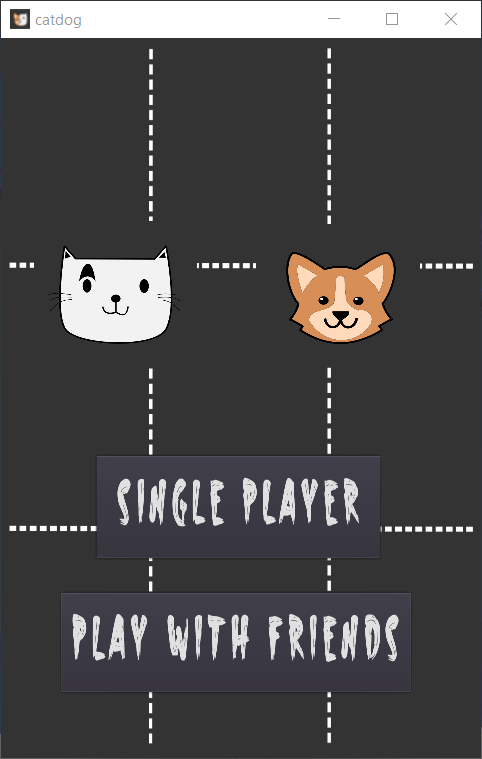
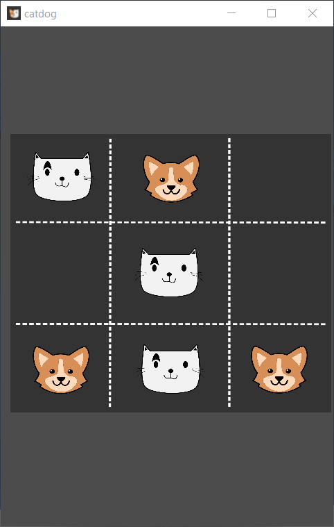
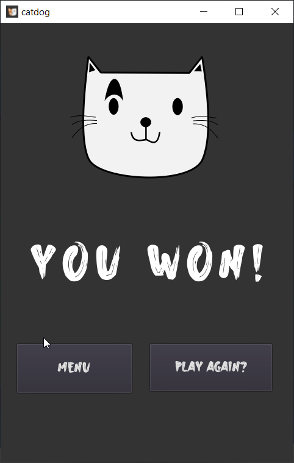

# catdog

Bored with old X-O's Tic Tac Toe? Here is Cat and Dog to make it more fun.

# About

2D board game made using Godot game engine. Can be played alone or with friends.

# How to play

In order to win the game, a player must place three of their marks in a horizontal, vertical or diagonal row.

# Game

Play in browser - [Click here](https://swanandx.itch.io/catdog)